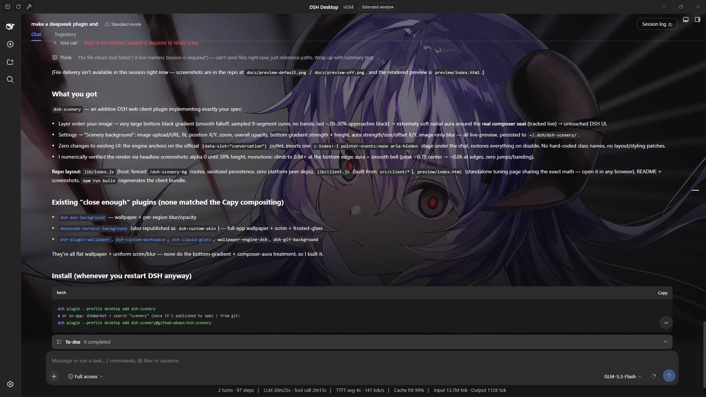
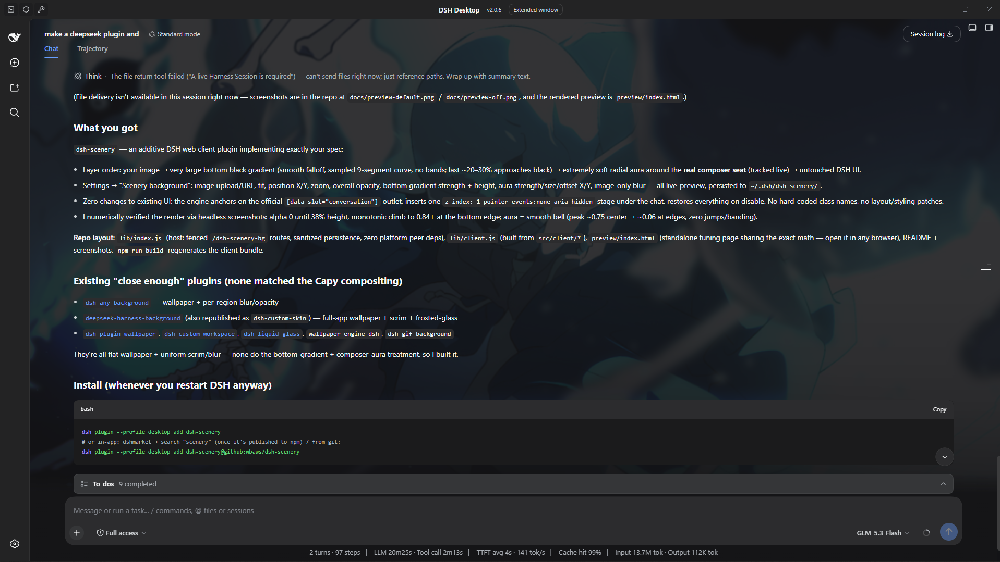

# dsh-scenery

Capy-style **ambient background** for the DeepSeek Harness (DSH) workspace —
an image, a very large bottom black gradient, and a soft radial “aura” around
the composer, so the UI looks like it is *sitting inside the scene* instead of
floating on a flat colour.

> **Additive only.** This plugin adds one click-through layer behind the
> conversation column. It does not redesign anything, does not touch the
> layout of existing components, and — unless you flip the switch — changes
> absolutely nothing about the way DSH looks or behaves.

| Scenery on — semi-full scene | Scenery on — barely there |
| --- | --- |
|  |  |

> Screenshots above show the effect live in DSH. Crank the opacity up and the
> image, bottom gradient and composer aura sit clearly behind the conversation;
> dial it right down and you get just a whisper of atmosphere — enough to make
> the workspace feel alive without stealing focus while you work. Every setting
> is live-previewable: the bundled standalone page (`preview/index.html`)
> renders the exact same compositing math in any browser, so you can tune a
> look here before it goes anywhere near your real setup.

## What it does

Layering (bottom → top):

```
① your image                (fit / pan / zoom / blur / opacity)
② large bottom black gradient   (soft, no bands; grows gradually, the last
                                 ~20–30% approaches black)
③ radial “aura” around the composer (very soft ellipse, black centre fading
                                 to nothing — no visible edge)
④ existing DSH UI            (completely untouched)
```

The aura tracks the *real* composer seat inside the conversation column
(sticky bottom bar), so it stays glued to the input area as you resize the
window or drag columns.

## Controls (Settings → Scenery background)

| Setting | Meaning |
| --- | --- |
| Enable | master switch — off by default |
| Image | upload a local picture (`PUT` to the host, stored under your DSH home) **or** paste an `http(s)` image URL |
| Fit | `cover` (crop-to-fill) / `contain` / `fill` |
| Position X/Y | object-position pan, % |
| Zoom | extra scale, 0.5×–3× |
| Overall opacity | dims image + overlays together toward the app surface |
| Bottom gradient strength | peak blackness of the big bottom gradient |
| Bottom gradient height | how much of the stage the gradient spans (from the bottom) |
| Aura strength | blackness of the composer aura |
| Aura size | ellipse radii multiplier |
| Aura offset X/Y | fine-tune aura centre relative to the auto-tracked composer |
| Image blur | gaussian blur of the image only — UI text stays crisp |

Every control previews live; **Save** persists to the host. There is also a
**Reset** (restores defaults and clears the current image) — it asks once
before it commits.

Persistence: `~/.dsh/dsh-scenery/config.json` (+ uploaded `wallpaper.*` file,
or `$DSH_HOME/dsh-scenery/` when `DSH_HOME` is set). A localStorage mirror
makes the background apply instantly on page load before the config round
trip.

## Install

Published on npm as `dsh-scenery` (this repo).

```bash
# official CLI (any profile)
dsh plugin --profile desktop add dsh-scenery

# or from the in-app plugin market (dshmarket → search "scenery")
# or straight from this repo:
dsh plugin --profile desktop add dsh-scenery@github:wbaws/dsh-scenery
```

Restart / reload DSH, open **Settings → Scenery background**, pick an image,
flip **Enable**. Done. (No code from Capy is used — only the general visual
technique, re-implemented in plain CSS.)

## How it works (brief)

**Client half** (`lib/client.js`, served at `/plugins/dsh-scenery/client.js`):

- Locates the conversation workspace through the official slot anchor
  `[data-slot="conversation"]` (no hard-coded class names).
- Inserts **one** absolutely positioned `z-index:-1`, `pointer-events:none`,
  `aria-hidden` stage as the first child of the conversation host. The host is
  made its own stacking context (`isolation:isolate`), so the stage paints
  *above* the host's flat background colour but *under every message and
  panel*. Nothing else in the app is modified.
- The stage holds an `` (fit/pan/zoom/blur) plus a scrim div whose
  `background` stacks the aura radial-gradient over the bottom
  linear-gradient. Both gradients are generated from the settings with many
  interpolation stops → smooth falloff, no banding.
- `ResizeObserver` + window resize keep geometry fresh; the composer seat is
  found by scanning for the sticky-bottom element inside the conversation
  host (cached, cheap).
- If the conversation seat isn't mounted yet (or was replaced by another
  plugin), it falls back to compositing onto the AppFrame element's own
  background layers — still zero DOM/layout changes.
- On disable/unload everything is removed and every inline style it added is
  restored.

**Host half** (`lib/index.js`, Cordis plugin `scenery`): a small fenced route
prefix `/dsh-scenery-bg` that persists config and wallpaper bytes
(GET/PUT/DELETE config, PUT/GET wallpaper). Zero platform peer deps — plain
Node builtins only, path-traversal-safe.

**Settings UI**: registers one section into the official
`settings.section` slot (id `scenery-config`), styled with the DSH alias
tokens so it follows the active theme.

## Development

```bash
npm run build   # concatenates src/client/* -> lib/client.js + syntax checks
npm run check
# interactive visual tuning:
#   open preview/index.html in a browser (uses window.SceneryCore from lib/client.js)
```

Layout:

```
lib/index.js            host half (Cordis plugin: persistence routes)
lib/client.js           built client bundle (do not edit)
src/client/00-defs.js   defaults / sanitizers / i18n
src/client/01-composite.js  pure gradient + aura math (shared with preview)
src/client/02-runtime.js    DOM engine (stage, tracking, modes)
src/client/03-settings-ui.js  settings section
src/client/04-entry.js   module-loader entry + window.SceneryCore
preview/index.html       standalone preview / tuning page
```

## Compatibility

Targets the official DSH web client (works in the DSH Desktop app window and
the web GUI). Requires a DSH profile with the client plugin system (same base
as `dsh-pet`, `dsh-better-sidebar`, etc.). If you find an incompatibility,
please open an issue with your DSH version.

## License

MIT. “Capy” styling is used purely as a visual reference; this is an
independent, from-scratch implementation of the general gradient technique.
